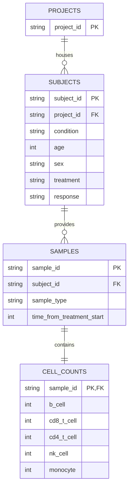

# Loblaw Bio - Clinical Trial Data Pipeline & Dashboard

This repository contains the data engineering pipeline, database schema design, and interactive dashboard built for Bob Loblaw (drug developer at Loblaw Bio) to analyze how a drug candidate (**miraclib**) affects immune cell populations.

The project incorporates comparisons against other potential therapeutic candidates under evaluation, including **phauximab** and the investigational agent **quintazide** (currently in comparative modeling stages).

---

## Getting Started

Follow these steps to set up the environment, execute the data pipeline, and run the dashboard. These steps are fully compatible with macOS and Linux environments (including GitHub Codespaces).

### Prerequisites
- Python 3.10+ (standard system Python or python.org installer recommended)
- `make` utility

### Execution Commands

All workflows are automated via the root `Makefile`. Run the following three commands in order:

1. **Setup Environment**:
   ```bash
   make setup
   ```
   This command creates a local Python virtual environment (`.venv`) and installs the required libraries (pandas, numpy, scipy, matplotlib, seaborn, streamlit) listed in [requirements.txt](file:///Users/ashokgaire/Desktop/Projects03/TeikoTechical/requirements.txt).

2. **Execute Data Pipeline**:
   ```bash
   make pipeline
   ```
   This sequentially executes the entire data pipeline without manual intervention. It triggers:
   - [load_data.py](file:///Users/ashokgaire/Desktop/Projects03/TeikoTechical/load_data.py): Initializes the SQLite database and loads `cell-count.csv`.
   - [run_analysis.py](file:///Users/ashokgaire/Desktop/Projects03/TeikoTechical/run_analysis.py): Performs cell frequency calculations, statistical significance testing, and cohort querying, exporting output tables, plots, and reports to the `output/` folder.

3. **Start Dashboard**:
   ```bash
   make dashboard
   ```
   This launches the local Streamlit server. Once running, you can open the dashboard in your web browser at:
   - **Local URL**: `http://localhost:8501`

---

## Code Structure

The repository is structured as a modular data analysis pipeline:

- [load_data.py](file:///Users/ashokgaire/Desktop/Projects03/TeikoTechical/load_data.py): Dedicated data ingestion script. Implemented using standard libraries to ensure zero external dependencies and fast bulk transactions.
- [run_analysis.py](file:///Users/ashokgaire/Desktop/Projects03/TeikoTechical/run_analysis.py): Orchestrates the scientific and statistical analysis. Queries the SQLite database and writes tables, reports, and plots.
- [app.py](file:///Users/ashokgaire/Desktop/Projects03/TeikoTechical/app.py): The interactive Streamlit dashboard. Delivers a highly polished, responsive dark-themed visual experience.
- [requirements.txt](file:///Users/ashokgaire/Desktop/Projects03/TeikoTechical/requirements.txt): Declares Python package dependencies.
- [Makefile](file:///Users/ashokgaire/Desktop/Projects03/TeikoTechical/Makefile): Automated script defining pipeline and server triggers for grading validation.
- `output/`: Folder containing generated reports, CSV exports, and figures.

---

## Relational Database Schema Design & Rationale

We normalized the flat CSV file into a relational schema to enforce data integrity, minimize redundancy, and optimize search speeds.



### Table Definitions
1. **`projects`**:
   - `project_id` (TEXT PRIMARY KEY): Distinct clinical study identifier.
2. **`subjects`**:
   - `subject_id` (TEXT PRIMARY KEY): Unique identifier for each trial participant.
   - `project_id` (TEXT FOREIGN KEY REFERENCES `projects`): The study to which the participant is enrolled.
   - Metadata columns: `condition` (Melanoma, Carcinoma, Healthy), `age`, `sex`, `treatment` (Miraclib, Phauximab, None), and `response` (Yes, No, NULL).
3. **`samples`**:
   - `sample_id` (TEXT PRIMARY KEY): Unique sample identifier.
   - `subject_id` (TEXT FOREIGN KEY REFERENCES `subjects`): Association with the participant.
   - Metadata columns: `sample_type` (PBMC, WB) and `time_from_treatment_start` (0, 7, 14).
4. **`cell_counts`**:
   - `sample_id` (TEXT PRIMARY KEY REFERENCES `samples`): 1-to-1 link containing absolute cell population measurements (`b_cell`, `cd8_t_cell`, `cd4_t_cell`, `nk_cell`, `monocyte`).

### Rationale and Future Scalability

- **Data Integrity and Normalization**: Flat files repeat patient-level demographics (e.g. age, gender, response) across every timepoint. Our schema isolates patient demographics into the `subjects` table, saving storage space and avoiding update anomalies.
- **Assay Extensibility (Vertical Scaling)**: Separating `cell_counts` from `samples` follows the Single Responsibility Principle. If we add new analytical assays (e.g., RNA-seq, bulk proteomics, single-cell TCR sequencing), we can add new tables linking back to `sample_id` without altering any sample registry tables.
- **Horizontal Scaling to Thousands of Projects / Millions of Samples**:
  - **Indexing**: Database query times are kept at $O(\log N)$ by placing B-Tree indexes on foreign keys (`project_id`, `subject_id`, `sample_id`) and query filters (`time_from_treatment_start`, `condition`, `treatment`).
  - **Database Migration**: Since SQLite is a file-based engine, this schema can be migrated directly to standard enterprise databases like **PostgreSQL** or **MySQL** without writing new query logic or modifying the Python pipeline.
  - **Flexible Ingestion of New Drug Candidates**: Adding another treatment cohort, such as **quintazide**, is as simple as adding a new row to the subjects table without altering database tables.

---

## Scientific Findings Summary

### Part 2: Initial Analysis
Relative frequencies (percentages) are calculated by dividing each cell count by the sum of B-cells, CD8+ T-cells, CD4+ T-cells, NK cells, and monocytes for that sample. The results are fully cataloged in [output/initial_analysis_summary.csv](file:///Users/ashokgaire/Desktop/Projects03/TeikoTechical/output/initial_analysis_summary.csv).

### Part 3: Statistical Analysis
Comparing responder vs. non-responder relative cell frequencies in melanoma patients treated with miraclib (PBMC samples):
- **All Timepoints Included**: **CD4+ T-cells** show a statistically significant difference (Welch's t-test $p = 0.0050$, Mann-Whitney U test $p = 0.0133$). Responders exhibit higher proportions of CD4+ T-helper cells (mean **30.538%** vs. **29.902%**). No other cell populations show significant differences.
- **Baseline (t=0) Only**: **No populations** display statistically significant differences (all $p > 0.20$), indicating that therapeutic response emerges dynamically during treatment rather than being present at baseline.
- Full details are in [output/statistical_analysis_report.md](file:///Users/ashokgaire/Desktop/Projects03/TeikoTechical/output/statistical_analysis_report.md) and visual boxplots are saved in [output/responders_vs_nonresponders_boxplots.png](file:///Users/ashokgaire/Desktop/Projects03/TeikoTechical/output/responders_vs_nonresponders_boxplots.png).

### Part 4: Cohort Exploration (Melanoma Baseline)
Within Melanoma PBMC samples receiving miraclib at $t=0$:
- **Cohort Count**: 656 samples / subjects.
- **Project Counts**: Project `prj1` (384), Project `prj3` (272).
- **Subject Responder Counts**: Non-responders `no` (325), Responders `yes` (331).
- **Subject Gender Counts**: Males `M` (344), Females `F` (312).
- **B-cell Count for Male Responders at Baseline**:
  - **Case A** (Receiving Miraclib): **10,401.28** cells.
  - **Case B** (Across All Treatments/Controls): **10,206.72** cells.
- Full details are in [output/subset_analysis_report.md](file:///Users/ashokgaire/Desktop/Projects03/TeikoTechical/output/subset_analysis_report.md).
